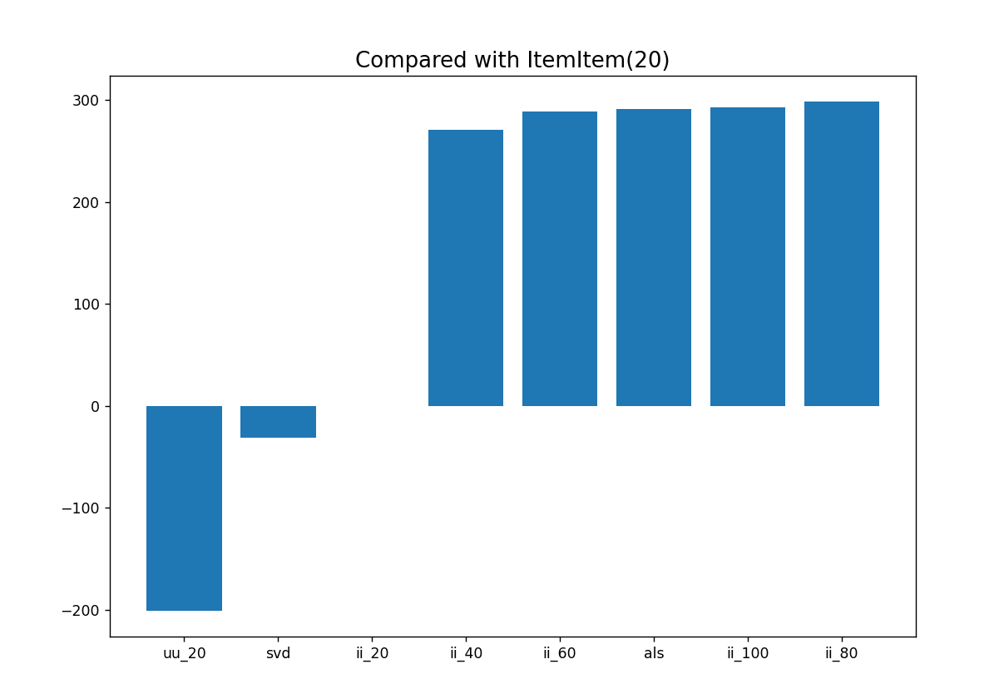
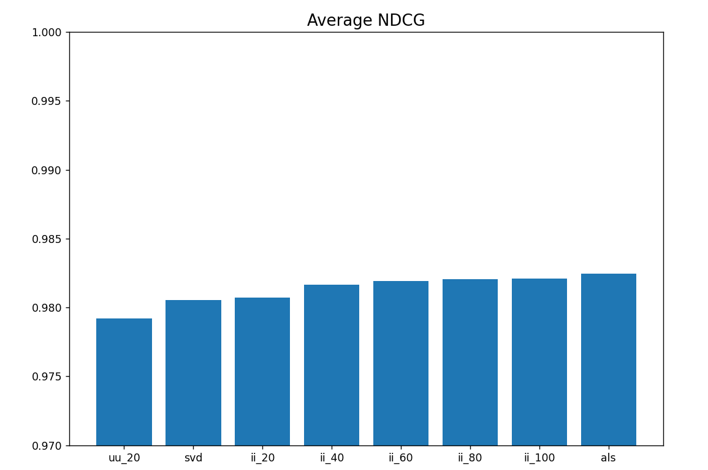

## 三、个性化检索（推荐）
### 1. 概要

#### 主要工具选取

* 预测评分算法：选取`lenskit`库中的`algorithms`
* NDCG计算：选取`sklearn`库中的`ndcg_score()`
* 简易图形绘制：选取`matplotlib`库中的`pyplot`

#### 框架构成&基本步骤

```
├─lab1_stage3    		
│  ├─doc				--->各算法文件夹; 原始数据与预处理后的数据
│  │  ├─als
│  │  ├─ii_100
│  │  ├─ii_20
│  │  ├─ii_40
│  │  ├─ii_60
│  │  ├─ii_80
│  │  ├─svd
│  │  └─uu_20
│  ├─fig
│  └─src
```

* 数据预处理(去除组内认为的corner case；以8：2划分训练集与测试集)；
* 利用不同算法/相同算法的不同参数，分别对上述数据进行用户的评分预测；
* 利用 NDCG 指标对上述预测进行评估；
* 对结果进行比较。

本次 stage-3 选择`Movie_score.csv`作为数据集，主要使用其中`user_id`、`item_id`、`score`三组数据。

### 2. 数据的预处理

#### 去除 Corner case

* 通过对原数据集的观察以及对豆瓣评分机制的理解，我们将`score == 0`的数据解释为“该用户并未对该电影进行打分”，认为是对预测没有帮助的数据，故删除

	```python
	raw_data = raw_data.drop(raw_data[raw_data.rating == 0].index)
	```

* 另一方面，为了排除用户“随意”打分的可能性，我们设想了一种情形为：某名用户对电影的打分基本相同。认为该种数据是不真实的，从数据集中删除

	```python
	for user in range(len(user_id_list)):
	    now_user_score = raw_data.loc[raw_data.user == user_id_list[user]]
	    total_len = len(now_user_score)
	    flag = 0  # 判断该用户是否为坏点
	    for i in range(1, 6):
	        # 该用户评分为 i 的电影个数
	        tmp_df = now_user_score.loc[now_user_score.rating == i]
	        i_len = len(tmp_df)
	        if i_len/total_len > 0.95:
	            flag = 1
	
	    if flag == 0:  # 是一个好的数据
	        pro_data = pd.concat([pro_data, now_user_score])
	```

#### 数据集划分

利用`sklearn.model_selection`中的函数，对上述处理后的数据集以8：2进行划分

```python
for i in range(len(user_id_list)):
    tmp_user_data = raw_data.loc[raw_data['user'] == user_id_list[i]]
    train_set, test_set = train_test_split(
        tmp_user_data, test_size=0.2, random_state=42)
    train_data = pd.concat([train_data, train_set])
    test_data = pd.concat([test_data, test_set])
```

> 也可以利用`lenskit`中的函数进行数据集划分：
>
> ```python
> for train, test in xf.partition_users(
>     ratings[['user', 'item', 'rating']], 5, xf.SampleFrac(0.2)):
>     test_data.append(test)
> ```

### 3. 评分预测与排序

使用`lenskit`库，本次实验选取 ALS、SVD、kNN 算法。其中对于 kNN 算法中的基于物品(Item-Item)算法，选取不同的近邻数 k 值（20，40，60，80，100）来比较优劣。

(1) 构造评估函数

```python
def eval(aname, algo, train, test):
    fittable = util.clone(algo)  # 复制这个算法
    fittable = Recommender.adapt(fittable)
    fittable.fit(train)
    # run the recommender
    recs = batch.predict(fittable, test)
    recs['Algorithm'] = aname
    return recs

```

(2) 得到每个用户的 NDCG 值

> 值得注意的是，经过数据预处理后的数据可能存在单点的情况，即一名用户只对一部电影有评分。由于实验要求给出用户评分排序，单点情况可以默认已排序，无需进行 NDCG 评估。

```python
def get_ndcg(df):

    df = df.sort_values(
        by=['user', 'prediction'], ascending=False)
    user_id_list = []
    ndcg_dic = {}

    # 将所有的user_id全放到一个列表中, 用来查找df中的用户
    for i in range(len(df)):
        if user_id_list.count(df.iloc[i, 0]) == 0:
            user_id_list.append(df.iloc[i, 0])
    for user in range(len(user_id_list)):
        tmp_user_data = df.loc[df['user'] == user_id_list[user]]
        pred = list(tmp_user_data['prediction'])
        true = list(tmp_user_data['rating'])
        # 将每个用户的 ndcg 分数存入 ndcg_dic 中
        # 若只有单个评分, 则无需考虑使用 ndcg 对其进行评估
        if len(pred) > 1: 
            ndcg_dic[user_id_list[user]] = ndcg_score([pred], [true])

    ndcg_df = pd.DataFrame.from_dict(
        ndcg_dic, orient='index', columns=['ndcg'])
    ndcg_df = ndcg_df.reset_index().rename({'index': 'user'}, axis='columns')

    return ndcg_df
```

(3) 写入文件（以 Item-Item 为例）

```python
    for i in range(5):
        k = 20*(1+i)
        algo = item_knn.ItemItem(k)
        n_path = 'lab1_stage3\doc\ii_{}'.format(str(k))
        if os.path.isdir(n_path) == False:
            os.mkdir(n_path)
        pred_data = []
        pred_data.append(eval('II_{}'.format(str(k)), algo, train, test))
        # 得到预测的数据df
        pred_data = pd.concat(pred_data, ignore_index=True)
        pred_data = pred_data.sort_values(
            by=['user', 'prediction'], ascending=False)
        pred_data.to_csv(
            r'{}\pred_data.csv'.format(n_path), index=False)

        results = get_ndcg(pred_data)

        results.to_csv(
            r'{}\ndcg_results.csv'.format(n_path), index=False)

```

详细数据可以在`lab1_stage3\doc\algo_name`文件夹中查询。

### 4. 结果分析

以 Item-Item(20)为基准，在不同的算法中，若某用户的 NDCG 值低于基准的 NDCG，则记为-1，反之+1。

```python
for i in algo_list:
    rst_path = "lab1_stage3/doc/{}/ndcg_results.csv".format(i)
    algo_rst_df = pd.read_csv(os.path.abspath(rst_path))
    num = 0
    flag = 0
    for k in range(len(algo_rst_df)):
        if algo_rst_df.iloc[k].iat[1] > base.iloc[k].iat[1]:
            num = num + 1
        elif algo_rst_df.iloc[k].iat[1] < base.iloc[k].iat[1]:
            num = num - 1
    rst_list.append(num)
```

利用`matplotlib.pyplot`绘制直方图：





从该实验中初步得到以下结论：

* 近邻数并不是越大越好。

	k值过小，容易受到异常点的影响，易过拟合；k值过大，受到样本均衡的问题，容易欠拟合。

	从整体上看，随着 k 的增大，整个用户的平均 NDCG 值增大，也即预测效果趋向于更好；近邻数相对于样本容量过小，如取20，此时增大k值对于评估结果的正确性会有较大提升。

* 基于用户的近邻预测结果欠佳。

	推测可能是用户基数较少（预处理后只有535位用户）/用户个性化明显，预测值易受到影响。

* ALS 算法比较优秀。

	ALS 同时考虑到 Item 和 User 两方面，所以综合性更好，相比起单独的 User-User 或者 k 值较小的 Item-Item 算法具有更高的 NDCG值。

